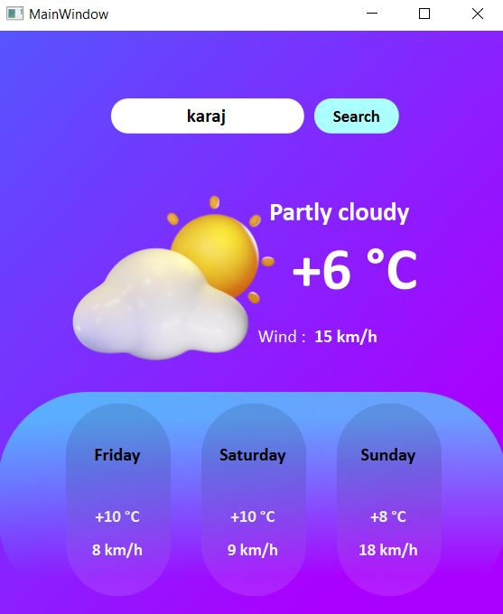

# GUI based Weather App


# Description :
Here, we are going to create a weather application using API from https://goweather.herokuapp.com/weather/{location} and Qt Designer .


# How to install 

``` 
pip install -r requirements.txt
```

# How to run 
```
python weather.py
```

# Results 


