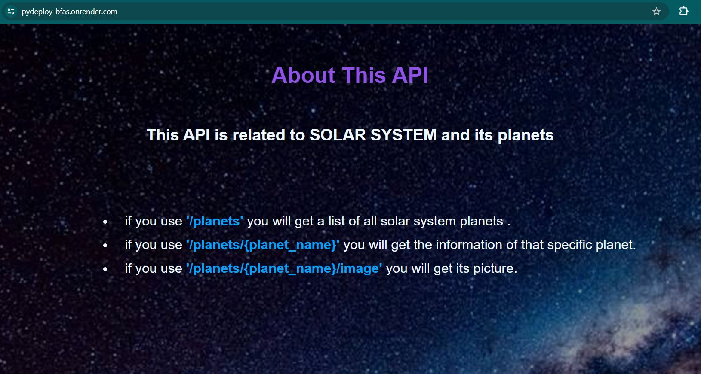

# Fast API :


# classCode :
## how to run :
1_ run this command in terminal : <br>
```
uvicorn filename:app --reload
```
+ here , in classCode file ,  ```app``` is the FastAPI object that we created  in the beginning of the code . <br>
+ ```--reload``` just used in development and it will not use in deployment in for example render.com

<br>

2_ copy this api link in postman ( get("/") ): 

<br>

``` http://127.0.0.1:8000 ``` 

<br>

3_ this link (http://127.0.0.1:8000/items/6) will give us sth like this : <br>

```
{
    "item_id": 6,
    "q": null
}
```

+ if we want to see our Document , we shold type http://127.0.0.1:8000 (which we ran in our terminal) in our browser and add ```docs``` at the end :
<br>

```
http://127.0.0.1:8000/docs
```
<br>

```/docs``` is a guid that helps users how to use from our API .

## Question :
where do these methods have been called ? <br>
+ DECORATORS will help methods to run when they have been needed . <br>

+ the default selected ip or port for running fastapi  is 127.0.0.1 with port 8000 . 

<br>

how to change port number: 
<br>

```
uvicorn filename:app --reload --port 8090 --host 0.0.0.0
```
<br>

we also should update port number in postman url address
<br>

free host : render.com <br>
so we need to use this url ``` https://pydeploy-bfas.onrender.com ``` to use our API , like this : <br>

# -------------------------------------------------------------------------------------------------

# 🌎🌍 Solar System  🌎🌍
<br>

## How to run + Results :
paste these links in your browser :
<br>
<br>

+ 1_ information about API : 
```
https://pydeploy-bfas.onrender.com/
```


<br>

+ 2_ show list of all planets :

```
https://pydeploy-bfas.onrender.com/planets
```

<br>

+ 3_ show information about just one planet , which added in the last part of below url :
<br>

```
https://pydeploy-bfas.onrender.com/planets/{planet_name}
```
<br>

+ 4_show image of defined single planet :
```
https://pydeploy-bfas.onrender.com/planets/{planet_name}/image
```


