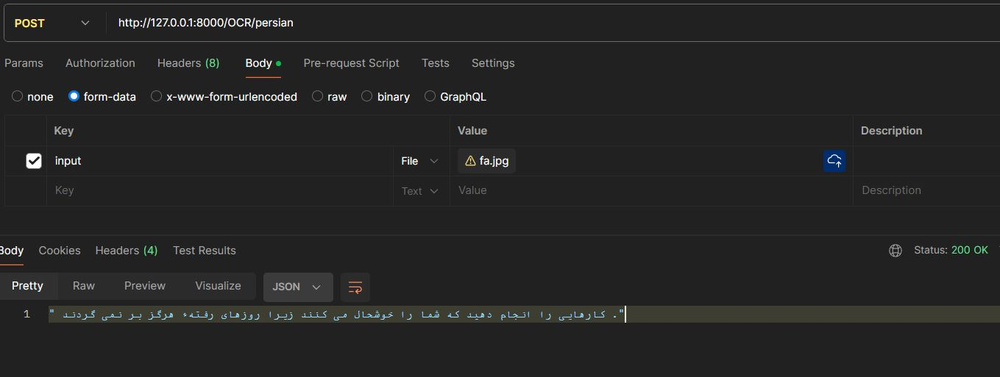

# Image Based APIs


## how to run ?
first of all run this command in terminal :

```
uvicorn ImageBased_API:app --reload
```

### in "ImageBased_API.py" file , there are 3 different APIs you can use :

# 1. OCR API
if you want to use OCR , after running above command , enter this url with <b>"POST"</b> method in postman :<br>
you can use both "English" or "english" endpoints for recognizing english texts :

```
http://127.0.0.1:8000/OCR/English
```
also , you can use "persian" ,"Persian" ,"farsi" ,"Farsi" for recognizing persian texts :

```
http://127.0.0.1:8000/OCR/Persian
```

### Results for OCR :
if user choose another language(except en & fa) , this message will be shown :


if user select persian/farsi endpoints and persian text image as well :


if user select english endpoint and english text image as well :


# ------------------------------------------------------------------------------------------------------------
