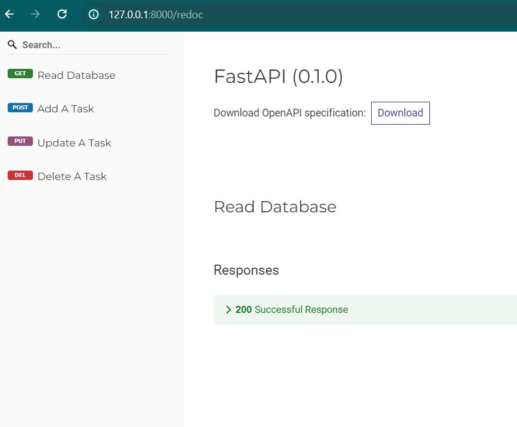
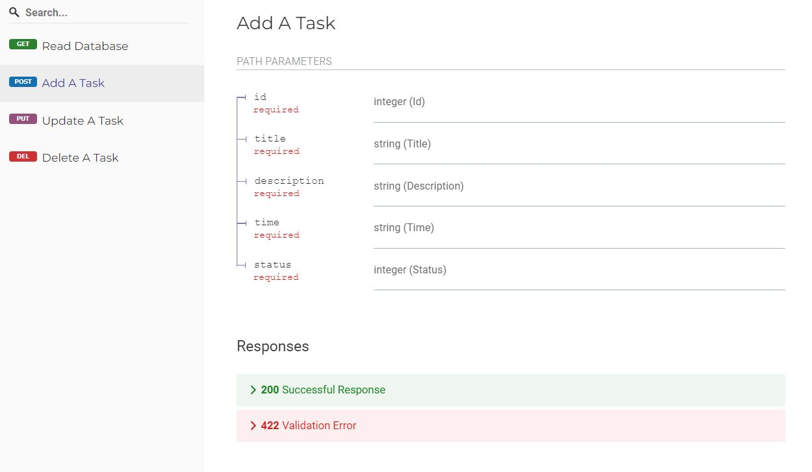
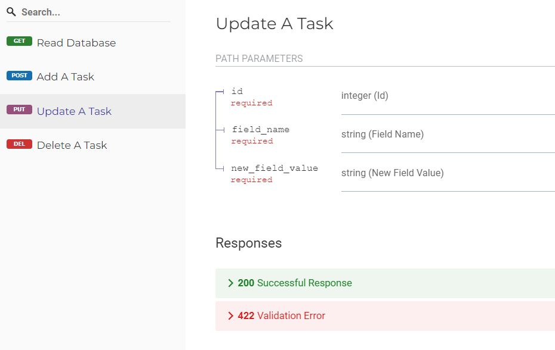
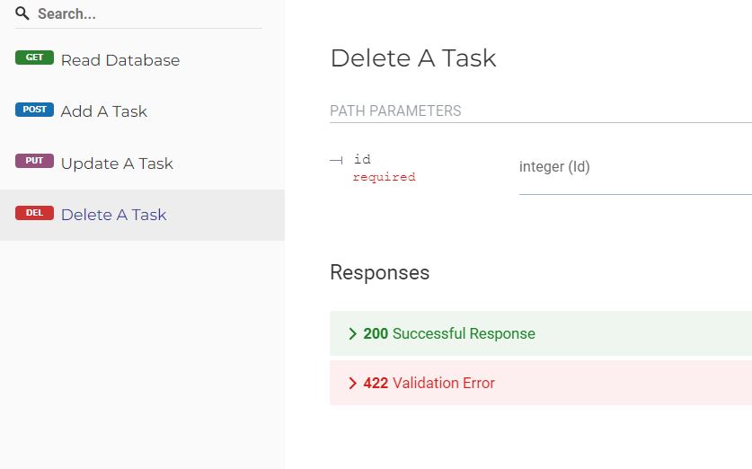

# TO-DO List App

here we want to connect a database like sqlite to an API , and do some basic tasks (read - add - update - remove) . 


Test the API using a tool like (http://127.0.0.1:8000/docs) or Postman.

# How to run :

First, type this command in terminal :

```
uvicorn ToDoList:app --reload
```

then , use postman or your browser to use these methods :

# <b>GET</b> :
### READ database
```
http://127.0.0.1:8000/read_db
```
here, you will see database's table .

<br>
<br>


# <b>POST</b> :
### Add a new task to database :
```
http://127.0.0.1:8000/add_task/{id}/{title}/{description}/{time}/{status}
```
<br>

# <b>PUT</b> :
### Edit / Update a task :
```
http://127.0.0.1:8000/update_task/{id}/{field_name}/{new_field_value}
```
you can also update task's id : <br>
Here, the id with the value of 15 will be changed to the value of 13 :
``` http://127.0.0.1:8000/update_task/15/id/13 ```

<br>
<br>

# <b>DELETE</b> :
### Delete a task :
just add task's id in its field :
```
http://127.0.0.1:8000/delete_task/{id}
```

# Reults :
redoc :
<br>



  