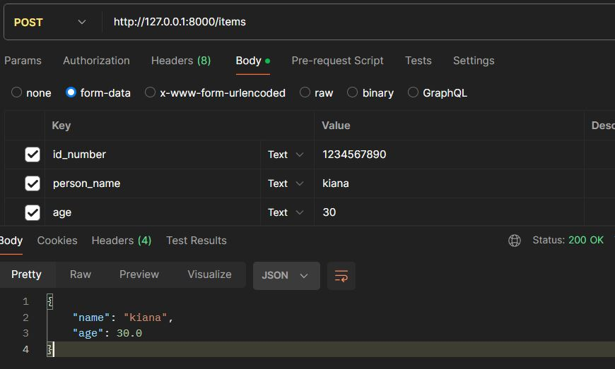
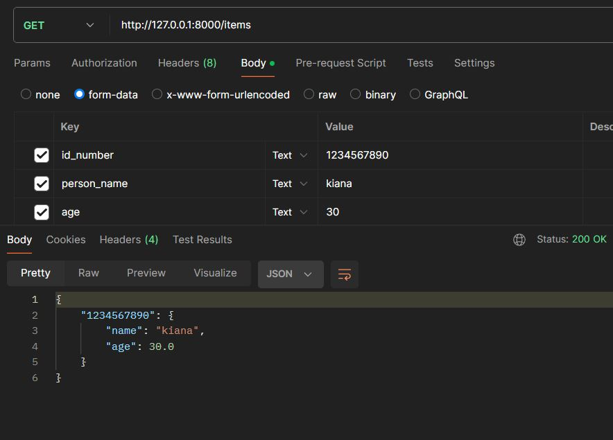
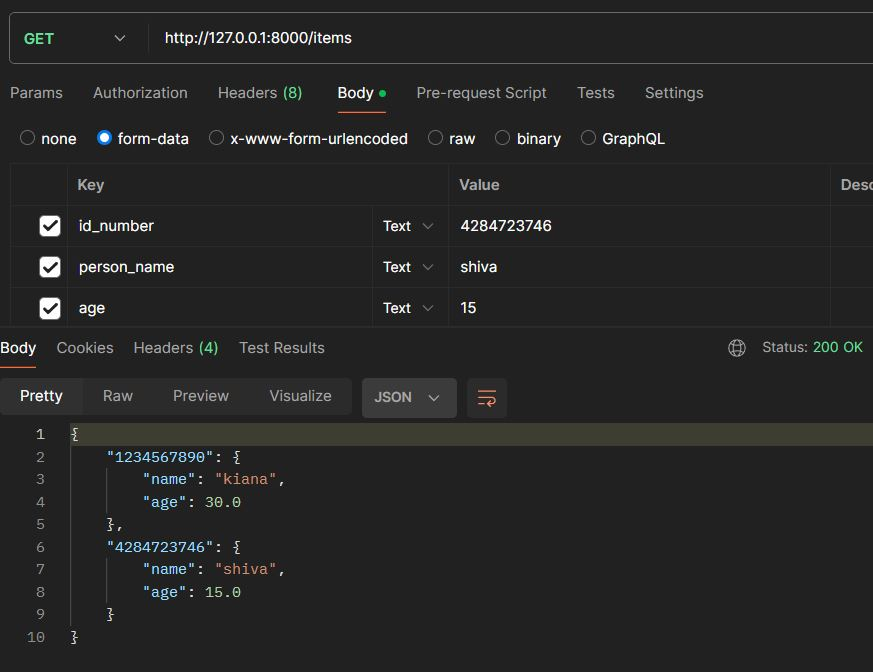
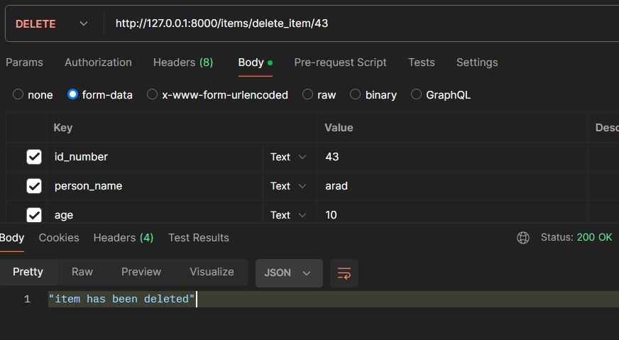
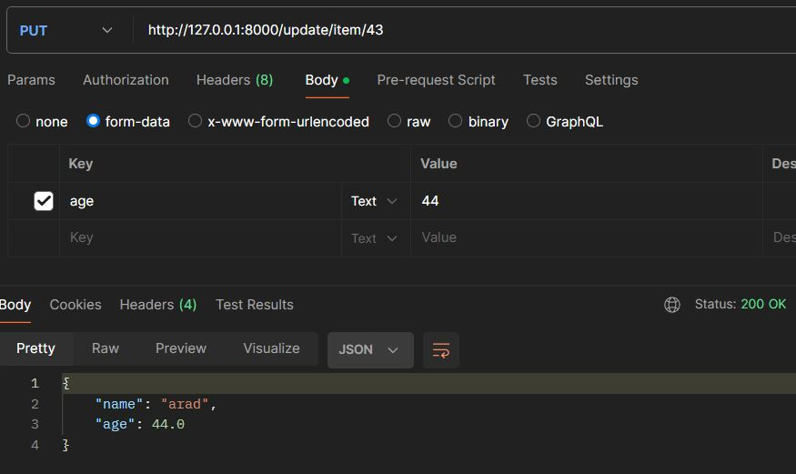
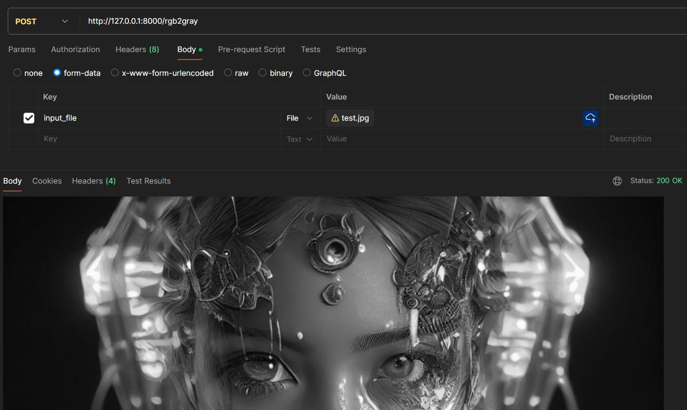

# FastAPI methods (GET , POST , PUT , DELETE)

<br>

# ClassCode :
<br>

related link : https://fastapi.tiangolo.com/tutorial/first-steps/
<br>

## HTTP "methods" :

```
POST: to create data.
GET: to read data.
PUT: to edit / update data.
DELETE: to delete data.
```
### how to use these methods ?
use these decorators :
```
@app.post()
@app.put()
@app.delete()
```
<br>
<br>

## How to run ?

+ # 1
first run this command in terminal :
```
uvicorn fastapi4:app --reload
```
<br>

+ # 2
then in poastman , with "POST" method , enter this url :  ```http://127.0.0.1:8000/items``` . 
then in Body --> form-data , enter required keys , their types and their values .

here , the database is not empty , and filled with entered data .

<br>

+ # 3
then use "GET" method , to see the result :

if we add another data using POST method, then use GET method again , output of database will be like this :


<br>

after each startup and reloading , database will be erased and we should enter data again.
therefore , we should use an external sql / no sql database . 

+ # 4
using delete method in postman :


<br> 

+ # 5
after adding items to database , now we want to update one of the item's value 


<br>

+ # 6
for using python scripts like fastapi on [liara]("liara.ir") , we should use DOCKER .
because when we want to insert new data to database , in hostes like render we cant update database which is in github . 
so we need to use docker , if we want to use DB file in liara's disk spaces . 

<br>

+ # 7
POSTing an image to api and get a processed image :


### -------------------------------------------------------------------------------

```
The command " uvicorn main:app --reload " refers to:

main: the file main.py (the Python "module"). 

app: the object created inside of main.py with the line app = FastAPI().

--reload: make the server restart after code changes. Only do this for development.
```
