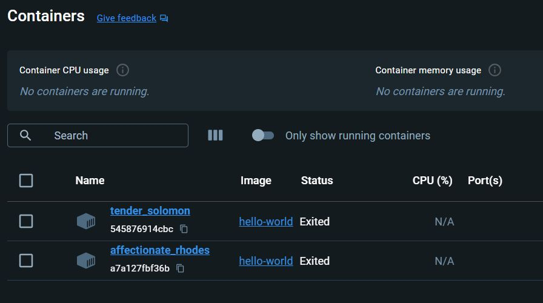
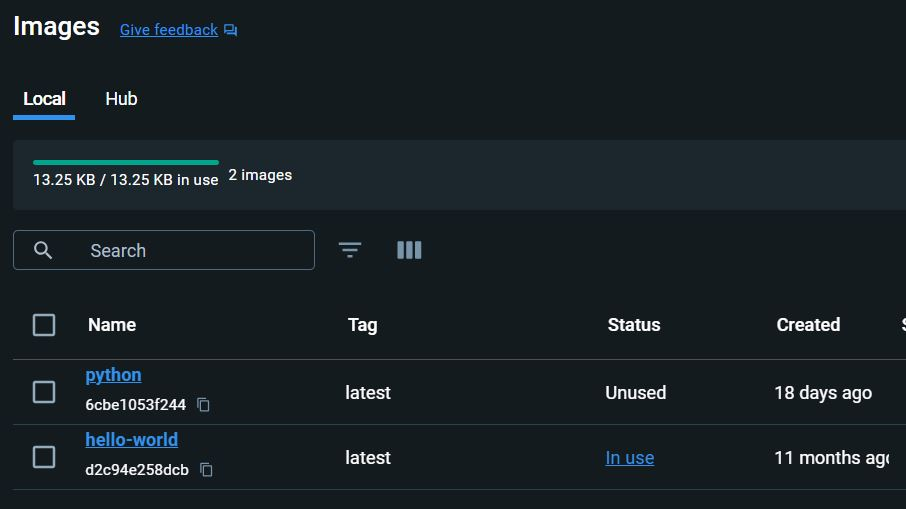

# FastAPI - Docker 

# Description :
here, we want to create docker image for FastAPI . bc there isnt any in 
[docker hub]("hub.docker.com") for FastAPI .

<br>

# How to run :
liara's docs :
```
https://fastapi-todo-app.liara.run/docs
```


## In postman :
+ Read database : (use GET metod in postman)
```
https://fastapi-todo-app.liara.run/read_db
```
+ Add new task to database : ( use POST method in postman)
```
https://fastapi-todo-app.liara.run/add_task/{id}/{title}/{description}/{time}/{status}
```

+ update or edit a task : (use PUT in postman)
```
https://fastapi-todo-app.liara.run/update_task/{id}/{field_name}/{new_field_value}
```

+ delete a task : (use DELETE in postman)
```
https://fastapi-todo-app.liara.run/delete_task/{id}
```

# ____________________________________________________________________________

# Docker :

+ Docker can have many "Images" (like classes in oop). <br>
+ then , we can have some "CONTAINERS" from an "Image" (like class objects )

### example :

+ how to bring a docker (like hello-world docker)into our system :
in this [link](https://hub.docker.com/_/hello-world) you can copy it's command and paste it in terminal : <br>
### 1_ ```docker pull hello-world``` 
<br>

### 2_ ```docker pull python```
then write : <br>

```docker images```
<br>

NOW we have 2 IMAGE : 
```
REPOSITORY     TAG        IMAGE ID         CREATED        SIZE 
python         latest     6cbe1053f244    2 weeks ago     1.02GB
hello-world    latest     d2c94e258dcb    11 months ago   13.3kB 
```


### 3_ ```docker pull tensorflow/tensorflow```
### 4_ ```docker pull pytorch/pytorch```
----------------------------------------------
<br>

## commands  : <br>

+ # ```docker images``` :
shows all docker images which are pulled in terminal .
+ # ```docker ps``` : 
shows list of only RUNNIG containers
<br>

+ # ```docker ps -a``` : 
shows list of all containers (even exited ones)
<br>

----------------------------------------------------------

# [How to build a Docker image for FastAPI :](https://fastapi.tiangolo.com/deployment/docker/) (from scratch)

+ Create an app directory and enter it.
+ Create an empty file ```__init__.py```.
+ Create a ```main.py``` file with:


+ # How to create containers from IMAGE ?

## 1_ create a container :
+ # ```docker run <ImageName>```
after running an IMAGE , a container will be create automatically .<br>
for example :<br>
(a container form helllo-world Image)
```docker run hello-world```
(from hello-world image , a container built )
until now , we have two images .
and one container .
if we run ```docker run hello-world``` again , therefore we will have TWO docker CONTAINERS (from hello-world image )
+ containers :

<br>

+ Images :


------------------------------------------

by runnig this command ```docker run python``` didnt anything happend . <br>
so we should add ```-it``` :
### ```docker run -it python bash ```
<br>

-it : means making command's run INTERACTIVE .

+ after runnig this command we enter to docker environment ! : <br>
``` root@7dcfdb670a76:/# ```
+ here it remains in docker and didnt exit from it & its status stay in runnig mode . ``` root@7dcfdb670a76:/# ```
+ here , docker container is running .
+ if we type ```docker ps -a``` in None docker terminal , we will have : <br>
```
CONTAINER ID   IMAGE         COMMAND     CREATED          STATUS                      PORTS     NAMES
7dcfdb670a76   python        "bash"      3 minutes ago    Up 3 minutes                          relaxed_keller
c4ab3c35e3ab   python        "python3"   22 minutes ago   Exited (0) 22 minutes ago             eloquent_booth
a7a127fbf36b   hello-world   "/hello"    54 minutes ago   Exited (0) 54 minutes ago             affectionate_rhodes
545876914cbc   hello-world   "/hello"    10 hours ago     Exited (0) 10 hours ago               tender_solomon 
``` 


<br>

-----------------------------
# How to delete a docker  : 
(dead) containers that are exited , Taking up the system space  .
so we have to delete them : <br>

``` 
docker rm <NAMES> 
 
    or 

docker rm <CONTAINER ID>
```
for example : ``` docker rm tender_solomon ```


# _______________________________________________________

# GOAL 
## Create Docker for FastAPI :
here we want to run a FastAPI project in docker (not in our os ) or virtual machine . but we didnt find a vm for FastAPI (in ducker hub). SO we should create a docker for it


--------------------------------
<br>

## 1_ create a file named __""Dockerfile""__ without any postfix .
## 2_ paste below codes from [FastAPI website](https://fastapi.tiangolo.com/deployment/docker/) into Dockerfile :
these are our docker layers :
```
FROM python

WORKDIR /code
 
COPY ./requirements.txt /code/requirements.txt

RUN pip install --no-cache-dir --upgrade -r /code/requirements.txt
 
COPY ./app /code/app

CMD ["uvicorn", "app.main:app", "--host", "0.0.0.0", "--port", "80"]
```
<br>

```
.
├── app
│   └── main.py
├── Dockerfile
└── requirements.txt
```
# 3_ How to build a docker Image :

 
+ ## ``` docker build -t <docker-image>   .  ```

<br>


# 4_ start & run a docker container : <br>

+ ## ```docker run -d --name myname -p 80:80 <docker-image>```


# ____________________________________________________________________________


# how to delete docker container  ?
```
├── Image
│   └── Container ──> container-NAMES 
```
if we run ``` docker rm container-NAMES``` , we will face this error , bc docker container is running : 

``` 
cannot remove container "/container-NAMES": container is running : stop the container before removing .
```
<br>

## 1_ ```docker stop container-NAMES``` --> exited
## 2_ ```docker rm container-NAMES```


# _________________________________________
+ ## make sure to delete all containers (Exited or running) :
## ``` docker ps -a ```


<br>
<br>
<br>


# Create a docker for FastAPI :

+ ## 0_ pip install -r requirements.txt (fastapi  ,pydantic, uvicorn )
+ ## 1_ docker pull python
+ ## 2_ docker build -t <docker-Image> 
+ ## 3_ docker run -d -p 80:80 <docker-Image>
+ ## 4_ ckeck it using liara or http://127.0.0.1/ localhost 


