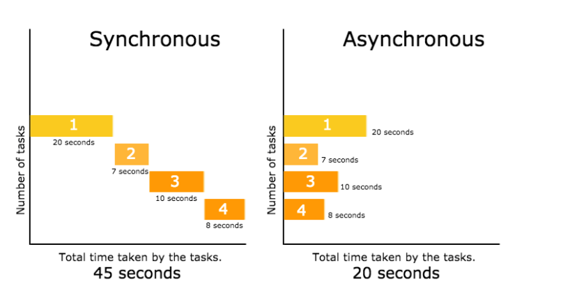

# Sync / Async 


## How to install :
```
pip install -r requirements.txt
```


## How to run :
```
python rhyme_finder.py
```

## Description :
+ related link : [async](https://fastapi.tiangolo.com/async/)
### asyncio package  :

+ we only can use __await__ before a ASYNC an function .

+ __await__ only can be used in async functions .

+ (async def) functions have to be awaited .
```
<< async >> def func_1() :
    ...

    
<< async >> def func_2()
    
     x = << await >> func_1(y)
```

## Sync :
in sync , tasks have to wait for their turn .
they will run in order : 1 , 2, 3 , 4 <br>
child_1 married after 2 years <br>
child_2 married after 8 years <br>
child_3 married after 2 years <br>
child_4 married after 1 years <br>
<br>
total time will be sumation of all tasks :  <br>
sum (2 , 8 , 2 , 1) =  executed in 13.03 seconds <br>


## Async :
in async  , tasks don't need to wait at all . they run when ever they want . <br>
child_3 married after 0 years<br>
child_2 married after 2 years<br>
child_1 married after 7 years<br>
child_4 married after 8 years<br>
<br>
total time is equal to the max time of all tasks :<br>
max( 0 , 2 ,  7 , 8 ) = executed in 8.069 seconds <br>


## conclusion : 

async functions runs faster than sync ones , bc async won't wait for running another function .<br>
in async , functions run simultaneously & together at the same time .




